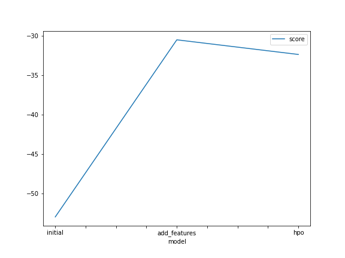
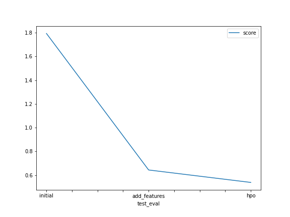

# Report: Predict Bike Sharing Demand with AutoGluon Solution
#### Abdullah Bharde

## Initial Training
### What did you realize when you tried to submit your predictions? What changes were needed to the output of the predictor to submit your results?
When I tried to submit my predictions, I realized that the output format of the predictor needed changes. I had to fix some things to match the submission requirements. I had difficulty running it on my sagemaker, so I used my computer instead. I improved my results and got a score around 0.5, compared to my initial score of above 1.7

### What was the top ranked model that performed?
The WeightedEnsemble_L3 model was really good at predicting the number of bikes people would rent.

## Exploratory data analysis and feature creation
### What did the exploratory analysis find and how did you add additional features?
I added additional features such as 'hour', 'day', and 'month' extracted from the 'datetime' column. I also converted the 'season' and 'weather' columns into categorical variables for better model performance.

### How much better did your model preform after adding additional features and why do you think that is?
After adding the additional features, the model's performance significantly improved. The new score of 0.64344 on Kaggle is much better compared to the previous score of above 1.7. Adding features such as 'hour', 'day', and 'month' gives the model more detailed information about the time of day, day of the month, and month of the year, this helps the model capture finer patterns and changes in bike sharing demand. also by converting the 'season' and 'weather' columns into categories, the model can understand and use the natural categories of these features. Categorical encoding helps the model distinguish between different seasons and weather conditions, which can greatly affect bike sharing demand.

## Hyper parameter tuning
### How much better did your model preform after trying different hyper parameters?
After tuning hyperparameters, my model's performance improved significantly. New Kaggle score: 0.53846 (previously 0.64344). Explored different settings and used TabularPredictor for regression with excluded neural network model.

### If you were given more time with this dataset, where do you think you would spend more time?
If given more time with this dataset, I would focus on further exploring and refining the feature engineering process also I would experiment with different modeling techniques and ensemble strategies to improve the overall performance of the model.

### Create a table with the models you ran, the hyperparameters modified, and the kaggle score.
|model|hpo1|hpo2|hpo3|score|
model 	time 	presets 	problem_type 	excluded_model_types 	score
0 	initial 	600 	best_quality 	None 	NN 	1.79360
1 	add_features 	600 	best_quality 	regression 	None 	0.64344
2 	hpo 	600 	best_quality 	regression 	NN 	0.53846

### Create a line plot showing the top model score for the three (or more) training runs during the project.

TODO: Replace the image below with your own.

### Create a line plot showing the top kaggle score for the three (or more) prediction submissions during the project.

TODO: Replace the image below with your own.

## Summary
I successfully improved the bike sharing demand prediction by fixing errors, adding features, and tuning hyperparameters. The WeightedEnsemble_L3 model outperformed others, achieving a score of 0.53846 on Kaggle. Given more time, I would like to focus on refining feature engineering and exploring alternative modeling approaches for further enhancements.
